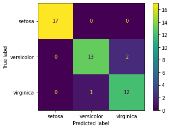

# Iris flower classification with Support Vector Machine

Which flower is this? With this model, I'm using the [Iris flower data set](https://en.wikipedia.org/wiki/Iris_flower_data_set) and a Support Vector Machine to classify which species of iris a given input is (Iris setosa, Iris virginica and Iris versicolor).

This is an example of linear discriminant analysis first presented on "The use of multiple measurements in taxonomic problems"

The three classes in the Iris dataset:
- Iris-setosa (n=50)
- Iris-versicolor (n=50)
- Iris-virginica (n=50)

The four features of the Iris dataset:
- sepal length in cm
- sepal width in cm
- petal length in cm
- petal width in cm

# Exploratory Data Analysis

## What's the correlation between species and the features measured?


# Working on the model

Since we are trying to classify the species of a given flower (iris), I'm going to use y as the classification category I'm trying to predict.

Therefore, X will be the dataset used to train the model (in this case, features measured).

The data has been split into X_train, X_test, y_train, y_test. (30% test size).

The model will be trained with the X array, which we'll compare to the y array to evaluate the model at the end.

To train the model, I've used the Support Vector Machine method from the SciKitLearn library.


# How good the model is?
 
In order to evaluate the model, we can check its confusion matrix:



And also its classification report:

```
              precision    recall  f1-score   support

      setosa       1.00      1.00      1.00        17
  versicolor       0.93      0.87      0.90        15
   virginica       0.86      0.92      0.89        13

    accuracy                           0.93        45
   macro avg       0.93      0.93      0.93        45
weighted avg       0.93      0.93      0.93        45
```

